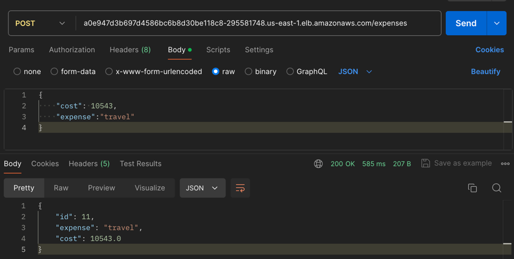
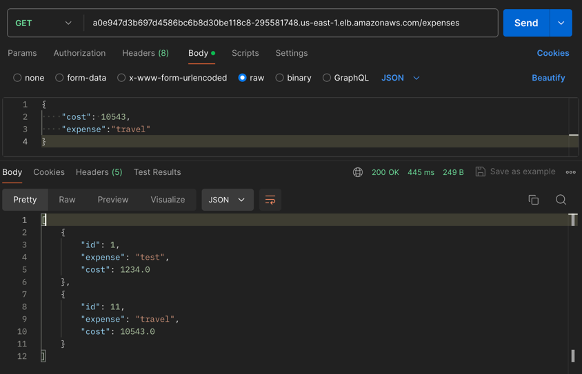
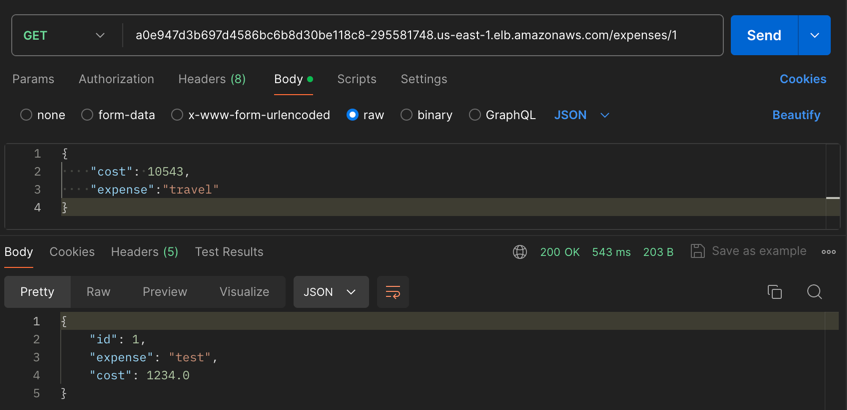
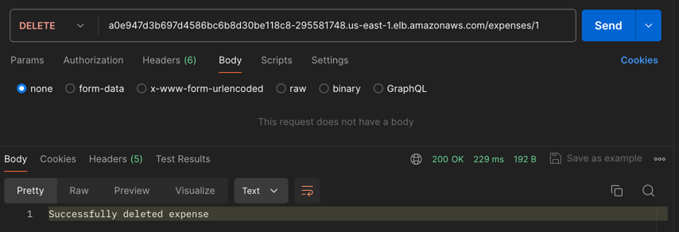

# Expense Tracker API
A simple CRUD API built with **Spring Boot**, utilizing AWS services such as RDS **PostgreSQL**, **Elastic Container Registry** (ECR), and **Elastic Kubernetes Service** (EKS) for deployment.

### Add expense

### Get all expenses

### Get expense by id

### Update expense

### Delete expense


---

### How to run locally:
1. Clone this repository.
2. Set up PostgreSQL database.
    ```shell
    CREATE DATABASE postgres;
    
    CREATE TABLE expenses (
        id SERIAL PRIMARY KEY,
        expense VARCHAR(120) NOT NULL,
        cost float NOT NULL	
    );
    ```
3. Install dependencies.
    ```shell
   # using maven
    mvn clean install
    ```
4. Run the application.
    ```shell
    java -jar target/expense-tracker-0.0.1-SNAPSHOT.jar
    ```

